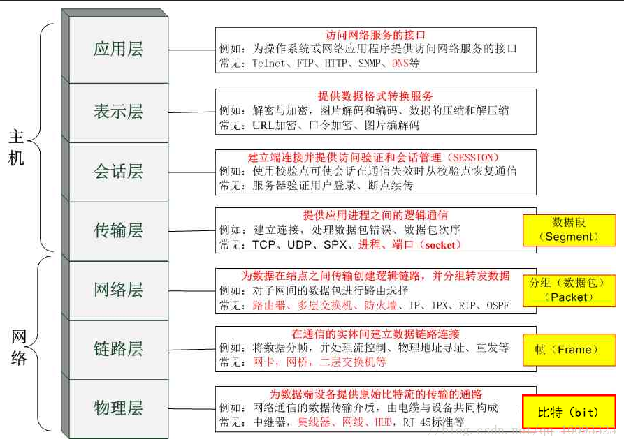
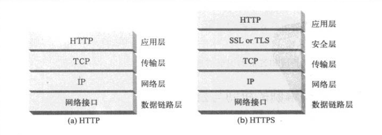
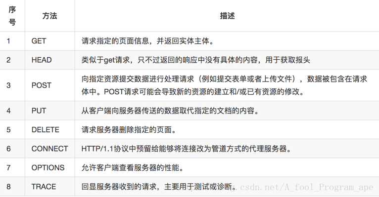
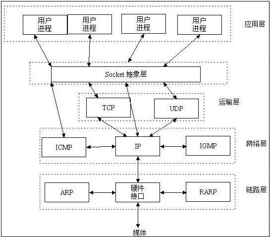
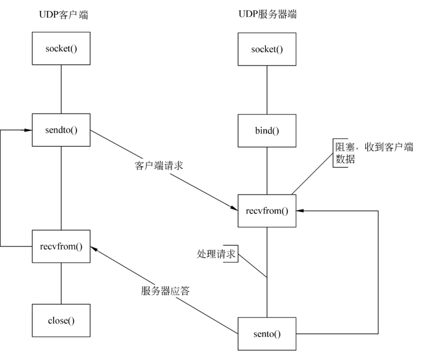

# Network

参考1：《Linux 高性能服务器编程》

参考2：《HTTP 权威指南》

参考3：牛客网C++面试宝典

待参考：《TCP/IP详解》三卷本

## Q：网络相关单词缩写

**1. 协议相关**

（1）ICMP：Internet Control Message Protocol

（2）IP：Internet Protocol

（3）TCP：Transmission Control Protocol

（4）UDP：User Datagram Protocol

（5）OSPF：Open Shortest Path First（a routing protocol）

（6）DNS：Domain Name System

**2. 具体名词**

参考1：https://www.jianshu.com/p/9722f55afd49

（1）MTU：Maximum Transmission Unit

一种通信协议的某一层上面能通过的最大数据包大小，以太网为 1500。数据包一旦超过此大小，就会进行分包，这也就有了 IP 分片的过程。

（2）MSS：Maximum Segment Size

传输控制协议的一个参数，以字节数定义一个计算机或通信设备所能接受的分段的最大数据量。注意这是不包含 IP 头及 TCP 或 UDP 头的，例如，对于
TCP，MSS = 1500 - 20（IP 头）- 20（TCP 头）
TCP 通过 MSS 提前进行分段，从而保证数据不会超过 MTU，来保证IP不需要再进行分片。

（3）SMSS：Sender Maximm Segment size，数据部分长度，一般等于 MSS。

（4）RWND：Receive Window

（5）SWND：Send Window

（6）CWND：Congestion Window

（7）RTT：Round Trip Time

（8）SRTT：Smooth Round Trip Time

（9）MSL：Maximum Segment Life，报文段最大生存时间

## Q：TCP 如何保证可靠性

**1. 发送应答 + 报文重排整理**

超时重传时间一般时 2 × RTT + 偏差值。

**2. 窗口控制**


**3. 超时重传 + 拥塞控制**

（1）SWND = min（RWND，CWND）发送窗口：太大容易导致网络拥塞，太小容易导致延迟。

（2）慢启动 + 拥塞避免：I. 一开始将窗口大小设置为1，之后每次收到确认，窗口大小 × 2。II. 设置慢启动阈值，CWND 达到阈值后，每经过一个 RTT，加 1。

（4）超时重传：先将阈值设置为当前 CWND 的一半，再将 CWND 设置为 1，重新慢启动。

（5）快速回复 + 快速重传算法：收到3次重复的确认报文，则立即进行重传。先将阈值设置为 CWND 的一半，然后将 CWND 设置为阈值 + 3（重新进入拥塞避免阶段）。


## Q：TCP TIME_WAIT 的概念和意义

1. TIME_WAIT 在 4 次挥手，发起 FIN 结束方收到对方的最后一次确认报文后进入的状态。

2. TIME_WAIT 状态一般存在 2 MSL 的时间，RFC 1122 建议 2 min。

3. TIME_WAIT 的意义：保证挥手的最后一次确认报文能够到达，能进行超时重传。2 MSL 后，这次连接的所有报文都会消失，不会影响下一次连接。

## Q：OSI 七层模型



OSI 模型是一个定义良好的协议规范集，方便了层间的接口标准化和模块化。是一个概念性的框架。

各个协议：

（1）Telnet：Internet 远程登录服务的标准协议。

（2）FTP：文件传输协议。

（3）SNMP：简单网络管理协议，在 IP 网络管理网路节点（服务器、工作站、路由器、交换机）的标准协议。

（4）SPX：序列分析交换协议，与 TCP 实现相同功能。

（5）IPX：互联网分组交换协议，提供分组寻址、路由选择功能。

## Q：TCP/IP 四层模型

与 OSI 七层模型的对应关系：

1. 应用层：OSI 应用层 + 表示层 + 会话层 ---- Ping + Telnet + OSPF + DNS

2. 传输层：OSI 传输层 ---- TCP + UDP + SCTP

3. 网络层：OSI 网络层 ---- ICMP + IP

4. 网络接口层/数据链路层：OSI 数据链路层 + 物理层 ---- ARP + RARP

## Q：网路层 IP 协议如何区分 UDP 和 TCP 报文

（１）根据端口区分，TCP：80端口，UDP：123端口。

测试端口是否开放方法：

```cpp
// TCP
telnet 220.181.38.148 80
// 返回结果：
Trying 220.181.38.148...
Connected to 220.181.38.148.
Escape character is '^]'.
// ================================================================
// UDP
nc -vuz 220.181.38.148 123
// 返回结果：
Connection to 220.181.38.148 123 port [udp/ntp] succeeded!
```

（２）根据 IP 头部中协议标志字段，6 是 TCP，17 是 UDP。

## Q：TCP 和 UDP

主要讲 UDP：

（1）UDP 没有拥塞控制。

（2）UDP 报文不合并不拆分，因此数据最好控制在 1472 字节以内，考虑到路由器可能会将 MTU 设置为不同的值，鉴于Internet上的标准MTU值为576字节,所以我建议在进行Internet的UDP编程时。最好将UDP的数据长度控件在548字节(576-8-20)以内.

（3）UDP 首部 8 字节，TCP 首部 20 字节。

（4）UDP 协议在视频传输、实时通信、游戏（比如网易游戏使用改进版的 UDP 协议）方面有应用。


## Q：TCP 握手和挥手 双方经历的状态

**三次握手**

发起端：SYN_SENT ---> ESTABLISHED

被动端：SYN_RCVD ---> ESTABLISHED

**四次挥手**

发起端：FIN_WAIT_1 ---> FIN_WAIT_2 ---> TIME_WAIT

被动端：CLOSE_WAIT ---> LAST_ACK ---> CLOSED

## Q：访问一个网页的全过程

参考1：https://blog.csdn.net/weibo1230123/article/details/82899205

1. **DNS解析：将域名转换成对应的IP地址**

（1）搜索浏览器自身缓存的DNS记录

（2）浏览器缓存没找到/记录已经过期，则搜索hosts文件（Linux下在/etc/hosts）

（3）如果hosts文件中没有/已经过期，则向DNS服务器发送解析请求

（4）如果DNS服务器也搜不到，则开始递归+迭代解析

-> 这里的递归+迭代解析，假设要解析 mail.google.com：

首先会向全球只有13台的根域服务器发出请求，显然，仅凭13台服务器不可能把全球所有IP都记录下来。所以根域服务器记录的是com域服务器的IP、cn域服务器的IP、org域服务器的IP。如果我们要查找.com结尾的域名，那么我们可以到com域服务器去进一步解析。根域服务器告诉我们com域服务器的IP。

接着我们的域名解析服务器会向com域服务器发出请求。根域服务器并没有mail.google.com的IP，但是却有google.com域服务器的IP。我们的域名解析服务器会向google.com域服务器发出请求。如此重复，直到获得mail.google.com的IP地址。

为什么是递归：问题由一开始的本机要解析 mail.google.com 变成域名解析服务器要解析 mail.google.com，这是递归。
为什么是迭代：问题由向根域服务器发出请求变成向com域服务器发出请求再变成向google.com域发出请求，这是迭代。

（5）获取域名对应的IP后，递归返回给浏览器

2. **Client发起TCP连接请求**

浏览器会选择一个大于1024的本机端口向目标IP地址的80端口发起TCP连接请求。经过标准的TCP握手流程，建立TCP连接。

3. **Client发送HTTP请求报文**

（1）按照HTTP协议标准生成一个索要网页的请求，比如 GET。

（2）如果采用 HTTPS 协议则会对 HTTP 数据进行加密。

（3）传输层 TCP 协议会对 HTTP 数据分段，加上 TCP 头部，递交给网络层。

（4）网络层 IP 协议对 TCP 数据段分组形成数据包，加上 IP 头部，并选择合适的路由，最后递交数据链路层。

（5）数据链路层对 IP 数据片封装成帧，加上以太网头部（+ 以太网尾部），发送。数据链路层还负责帧的差错检测（CRC校验码）。

4. **Server处理后返回响应报文**

（1）可能会与负载均衡，如Nginx服务器（一款面向性能设计的HTTP服务器）。

如果我们的平台配备了负载均衡的话，前一步DNS解析获得的IP地址应该是我们Nginx负载均衡服务器的IP地址。所以，我们的浏览器将我们的网页请求发送到了Nginx负载均衡服务器上。

Nginx根据我们设定的分配算法和规则，选择一台后端的真实Web服务器，与之建立TCP连接、并转发我们浏览器发出去的网页请求。

Web服务器收到请求，产生响应，并将网页发送给Nginx负载均衡服务器。

Nginx负载均衡服务器将网页传递给filters链处理，之后发回给我们的浏览器.

5. **浏览器渲染**

（1）浏览器根据页面内容，生成DOM Tree。根据CSS内容，生成CSS Rule Tree(规则树)。调用JS执行引擎执行JS代码。

（2）根据DOM Tree和CSS Rule Tree生成Render Tree(呈现树)。

（3）根据Render Tree渲染网页。

在浏览器解析页面内容的时候，发现页面引用了其他未加载的image、css文件、js文件等静态内容，可能会访问CDN。

（4）网页静态资源加载：

什么是CDN？如果我在广州访问杭州的淘宝网，跨省的通信必然造成延迟。如果淘宝网能在广东建立一个服务器，静态资源我可以直接从就近的广东服务器获取，必然能提高整个网站的打开速度，这就是CDN。CDN叫内容分发网络，是依靠部署在各地的边缘服务器，使用户就近获取所需内容，降低网络拥塞，提高用户访问响应速度。

接下来的流程就是浏览器根据url加载该url下的图片内容。本质上是浏览器重新开始第一部分的流程，所以这里不再重复阐述。区别只是负责均衡服务器后端的服务器不再是应用服务器，而是提供静态资源的服务器。

## Q：HTTP 与 HTTPS

HTTPS = HTTP + SSL（Secure Sockets Layer 安全套接层）

1. **区别**

（1）HTTP 协议是以明文的方式在网络中传输，而 HTTPS 协议传输的数据则是经过 SSL/TLS 加密后的，具有更高的安全性。

（2）HTTPS 在 TCP 三次握手后，还需要进行 SSL 握手，协商加密使用的对称加密密钥。

（3）HTTPS 协议需要服务端申请证书，浏览器端安装对应的根证书。

（4）HTTP 协议端口时 80，HTTPS 协议端口是 443。

2. **HTTPS概览**

HTTP 请求和响应数据在发送到网络之前都要进行加密。从 HTTP 到 HTTPS 只需要用 SSL/TLS 的输入、输出调用取代 TCP 的调用。



**优点：**

（1）HTTPS 使用密钥进行加密，因此安全性更高。

（2）HTTPS 可以认证用户和服务器，可以确保数据发送到正确的用户、服务器。

**缺点：**

（1）HTTPS 需要 SSL 握手，因此整个握手阶段延时增加。

（2）HTTPS 部署成本较高，需要购买 CA证书。并且，需要的 CPU 资源较多，为了进行加密解密。

3. **HTTPS加密**

讲的不错的博文：https://blog.51cto.com/11883699/2160032


## Q：HTTP 请求报文

参考1：https://blog.csdn.net/a_fool_program_ape/article/details/81748544

1. **组成**

（1）请求行（request line）

（2）请求头部（header）

（3）空行（CR LF）

（4）请求数据部分

2. **请求行**

由 请求方法，URL，HTTP协议 三个字段组成，用空格隔开。

（example：GET /index.html HTTP/1.1）



3. **请求头部**

由键/值对组成，每行一对，用冒号隔开。典型的常用请求头部：

User-Agent：产生请求的客户端类型。

Accept：客户端可识别的内容类型列表。

Host：请求的主机名，允许多个域名同处一个IP地址，即虚拟主机。

Accept-Charset： 通知服务端可以发送的编码格式

Accept-Encoding： 客户端使用的编码环境和编码方式

Accept-Language： 客户端语言环境

Authorization：授权信息，一般用于存放授权之后的信息

Connection：表示是否需要持久连接

Content-Length：表示请求数据正文的长度

Cookie：这个与服务器端做交互的，存储保持会话的重要信息

Referer：表示该次请求的来源，一般用于做防盗链

## Q：HTTP POST 和 GET 的区别

1. GET：发送请求，服务器相应 200，并返回数据。

2. POST：先发送 header，服务器相应 100 continue，浏览器再发送数据，服务器再相应 200，并返回数据。

3. GET 产生一个 TCP 数据包，而 POST 产生两个。

## Q：HTTP 幂等性

**1. 概念**

定义：是指一次和多次请求某一个资源有相同的副作用。幂等性对于分布式系统设计十分重要。


## Q：HTTP响应报文

参考1：https://blog.csdn.net/a_fool_program_ape/article/details/81748544

1. **组成**

（1）状态行（status line）

（2）响应头部

（3）空行

（4）响应数据部分

2. **状态行**

由 HTTP版本，状态码，解释状态码的简单短语 组成。

(HTTP_version, status_code, reason_phrase, CRLF)

•• 1xx：指示信息--表示请求已接收，继续处理。

•• 2xx：成功--表示请求已被成功接收、理解、接受。

•• 3xx：重定向--要完成请求必须进行更进一步的操作。

•• 4xx：客户端错误--请求有语法错误或请求无法实现。

•• 5xx：服务器端错误--服务器未能实现合法的请求。

常见状态代码、状态描述的说明如下。

•• 200 OK：客户端请求成功。

•• 300 多选重定向（Multiple Choices）：客户端啊，被请求的资源有一系列可选的反馈信息，你自己选一个吧。

•• 301 永久重定向（Moved Permanently）：客户端啊，你要请求的资源已经永久的搬家了，我把他的新地址放到了Location头部域中了；

••302 临时重定向（Moved Temporarily）：客户端啊，你要请求的资源临时有事去别的地方了，我把他的位置放到了Location头部域中了，你可以先去那里找他，不过他应该是会回到他自己的家的；

••304 Not Modified：客户端啊，你要请求的资源自从上次你请求之后，就再也没有改动过，我想你是应该早就有这个资源了，所以在响应报文的数据部分我也没有再放这个资源。

•• 400 Bad Request：客户端请求有语法错误，不能被服务器所理解。

•• 401 Unauthorized：请求未经授权，这个状态代码必须和WWW-Authenticate报头域一起使用。

•• 403 Forbidden：服务器端顺利收到了客户端的请求，但是因为某些理由，服务器端拒绝为他提供服务

•• 404 Not Found：请求资源不存在，八成是资源地址写错了；举个例子：输入了错误的URL。

•• 500 服务器内部错误（Internal Server Error）：服务器发生不可预期的错误。

•• 502 代理网关错误（Bad Gateway）：客户端你好，我是请求报文的代理服务器，持有资源的那个服务器在给我发送资源时出问题了；

•• 503 服务器不可用（Server Unavailable）：服务器当前不能处理客户端的请求，一段时间后可能恢复正常

3. **响应头部**

常见的：

Server：服务器应用程序软件的名称和版本

Content-Type：响应正文的类型（图片/二进制串）

（如：Content-Type:text/html;charset=ISO-8859-1）

Content-Length：响应正文的长度

Content-Charset：响应正文使用的编码

Content-Encoding：响应正文使用的数据压缩格式

Content-Language：响应正文使用的语言

4. **例子**

（1）HTTP请求报文例子

GET

```html
GET /search?hl=zh-CN&source=hp&q=domety&aq=f&oq= HTTP/1.1
Accept: image/gif, image/x-xbitmap, image/jpeg, image/pjpeg, application/vnd.ms-excel, application/vnd.ms-powerpoint,
application/msword, application/x-silverlight, application/x-shockwave-flash, */*
Referer: <a href="http://www.google.cn/">http://www.google.cn/</a>
Accept-Language: zh-cn
Accept-Encoding: gzip, deflate
User-Agent: Mozilla/4.0 (compatible; MSIE 6.0; Windows NT 5.1; SV1; .NET CLR 2.0.50727; TheWorld)
Host: <a href="http://www.google.cn">www.google.cn</a>
Connection: Keep-Alive
Cookie: PREF=ID=80a06da87be9ae3c:U=f7167333e2c3b714:NW=1:TM=1261551909:LM=1261551917:S=ybYcq2wpfefs4V9g;
NID=31=ojj8d-IygaEtSxLgaJmqSjVhCspkviJrB6omjamNrSm8lZhKy_yMfO2M4QMRKcH1g0iQv9u-2hfBW7bUFwVh7pGaRUb0RnHcJU37y-
FxlRugatx63JLv7CWMD6UB_O_r
```

POST

```html
POST /search HTTP/1.1
Accept: image/gif, image/x-xbitmap
Connection: Keep-Alive

username=zhangsan&password=123
```


（2）HTTP响应报文例子

```html
HTTP/1.1 200 OK
Date: Sat, 31 Dec 2005 23:59:59 GMT
Content-Type: text/html;charset=ISO-8859-1
Content-Length: 122

<html>
<head>
<title>Wrox Homepage</title>
</head>
<body>
<!-- body goes here -->
</body>
</html>

```

## Q：HTTP 常见问题

参考1：https://blog.csdn.net/a_fool_program_ape/article/details/81748544

1. **HTTP协议无状态**

HTTP是无状态的面向连接的协议，其对事务处理没有记忆能力。但是无状态不代表HTTP不能保持TCP连接。

从HTTP/1.1起，默认都开启了Keep-Alive，保持连接特性，简单地说，当一个网页打开完成后，客户端和服务器之间用于传输HTTP数据的TCP连接不会关闭。但有一个保持时间。

2. **HTTP与TCP的关系**

HTTP属于应用层协议，TCP属于传输层协议，IP属于网络层协议。

HTTP协议的长连接和短连接，实质上是TCP协议的长连接和短连接。

关于长连接：

参考1：https://www.cnblogs.com/gotodsp/p/6366163.html

```
我们再模拟一下长连接的情况：client向server发起连接，server接受client连接，双方建立连接。

client与server完成一次请求后，它们之间的连接并不会主动关闭，后续的读写操作会继续使用这个连接。
\\

TCP的保活功能主要为服务器应用提供。如果客户端已经消失而连接未断开，则会使得服务器上保留一个半开放的连接.
而服务器又在等待来自客户端的数据，此时服务器将永远等待客户端的数据。
保活功能就是试图在服务端器端检测到这种半开放的连接。
\\
如果一个给定的连接在两小时内没有任何动作，服务器就向客户发送一个探测报文段，根据客户端主机响应探测4个客户端状态：
\\
客户主机依然正常运行，且服务器可达。此时客户的TCP响应正常，服务器将保活定时器复位。

客户主机已经崩溃，并且关闭或者正在重新启动。上述情况下客户端都不能响应TCP。服务端将无法收到客户端对探测的响应。

服务器总共发送10个这样的探测，每个间隔75秒。若服务器没有收到任何一个响应，它就认为客户端已经关闭并终止连接。

客户端崩溃并已经重新启动。服务器将收到一个对其保活探测的响应，这个响应是一个复位，使得服务器终止这个连接。

客户机正常运行，但是服务器不可达。这种情况与第二种状态类似。
```

3. **GET与POST**

GET 参数追加在 URL 后，长度受限制，不安全。

POST 参数在请求报文的请求数据部分，长度比GET的限制长（在HTTP/1.1中无限制，但在服务器会限制），安全。


## Q：socket 是什么

参考1：https://www.jianshu.com/p/b68d2b26f5f4

Socket是应用层与TCP/IP协议族通信的中间软件抽象层，它是一组接口。在设计模式中，Socket其实就是一个门面模式，它把复杂的TCP/IP协议族隐藏在Socket接口后面，对用户来说，一组简单的接口就是全部，让Socket去组织数据，以符合指定的协议。



## Q：socket 网络编程函数大全

**1. I/O 相关**

**（1）read 和 write**

**通用的 fd 读写函数。**

返回 > 0 是读入、写出的大小，小于 0 是错误。
```cpp
ssize_t read(int fd,void *buf,size_t nbyte);
ssize_t write(int fd, const void*buf,size_t nbytes);
```

**（2）TCP 读写：recv 和 send**

**专门提供给 socket 读写的系统调用。**

和 read write 的区别是提供了第四个参数来控制读写操作。

```cpp
int recv(int sockfd,void *buf,int len,int flags);
int send(int sockfd,void *buf,int len,int flags);
```

**Notice：recv 函数会等待 fd 的发送缓冲区中的数据被协议传送完毕后，再从读缓冲区中读取数据。**

第四个参数可以是0或者是以下的组合：

MSG_DONTROUTE | 不查找表：（send函数使用）目的主机在本地网络上面,没有必要查找表.这个标志一般用网络诊断和路由程序里面.

MSG_OOB | 表示可以接收和发送带外的数据

MSG_PEEK | 查看数据：（recv函数使用）表示只是从系统缓冲区中读取内容,而不清除系统缓冲区的内容.这样下次读的时候,仍然是一样的内容.一般在有多个进程读写数据时可以使用这个标志。

MSG_WAITALL | 等待所有数据：（recv函数使用）表示等到所有的信息到达时才返回.使用这个标志的时候recv回一直阻塞,直到指定的条件满足,或者是发生了错误. 1)当读到了指定的字节时,函数正常返回.返回值等于len 2)当读到了文件的结尾时,函数正常返回.返回值小于len 3)当操作发生错误时,返回-1,且设置错误为相应的错误号(errno)

**（3）UDP 读写：recvfrom 和 sendto**

```cpp
ssize_t recvfrom(int sockfd, void* buf, size_t len, int flags,
                                 struct sockaddr* src_addr, socklen_t* addrlen);
ssize_t sendto(int sockfd, const void* buf, size_t len, int flags,
                                 const struct sockaddr* dest_addr, socklen_t addrlen);
```

因为 UDP 没有连接的概念，每次读写都需要指定地址。

Notice！！！ recvfrom 和 sendto 也可以用于 STREAM 连接，后两个参数设置为 NULL。


**2. 网络相关**

**（1）创建 socket**

```cpp
#include <sys/socket.h>
#include <sys/types.h>
int socket(int domain, int type, int protocol);
```

domain：PF_INET（IPv4），PF_INET6（IPv6），PF_UNIX（本地）

type：SOCK_STREAM（TCP），SOCK_DGRAM（UDP）

protocol：在协议集合下再选具体协议，通常为 0（默认协议）

**（2）socket 与地址绑定**

该地址描述了 IP地址，端口，协议族。

```cpp
int bind(int sockfd, const struct sockaddr* addr, socklen_t addrlen);
```

**（3）开启监听**

```cpp
int listen(int listenfd, int backlog);
```

backlog：内核监听队列的最大长度（指的是已完成连接的最大数量 + k）。若超过，客户端将收到 ECONNREFUSED。

**（4）接受连接**

```cpp
int accept(int listenfd, struct sockaddr* client_addr, socklen_t* client_addrlen);
```

accept 只是从队列中取得连接，不关心连接的状态（ESTABLISHED / CLOSE_WAIT），更不关心网络状态的变化。

内核维护了一个半连接队列和一个已完成连接队列。accept 会取下已完成连接队列。

**（5）发起连接**

```cpp
int connect(int sockfd, const struct sockaddr* serv_addr, socklen_t serv_addr);
```

常见的 errno：ECONNREFUSED（目标端口不存在），ETIMEOUT（连接超时）。

**（6）关闭连接 / fd**

```cpp
#include <unistd.h>
int close(int fd);
```

具体为将 fd 的引用计数减一。

**（7）强制关闭**

```cpp
int shutdown(int sockfd, int howto);
```

howto：SHUT_RD（关闭读），SHUT_WR（关闭写），SHUT_RDWR（关闭读写）

强制关闭直接无视引用计数！


## Q：UDP 网络编程




## Q：MIME

- **概念**

全称为：Multipurpose Internet Mail Extensions，多用途互联网邮件扩展。是一种应用广泛的电子邮件技术规范。（最初的目的是为了在发送电子邮件时附加多媒体数据。）

在HTTP中，MIME类型被定义在Content-type header中。

- **类型与格式**

MIME类型由两个部分组成：（1）数据的大类别 （2）具体的种类

常见的MIME类型：

（1）超文本标记语言文本 .html： text/html

（2）普通ASCII文本 .txt： text/plain

（3）RTF文本 .rtf： application/rtf

（4）GIF图像 .gif： image/gif

（5）JPEG格式的图片 .jpeg： image/jpeg

（6）MS的powerpint文件 .ppt： application/vnd.ms-powerpoint

（7）au声音文件 .au： audio/basic

（8）MPEG文件 .mpeg： video/mpeg

（9）AVI文件 .avi： video/x-msvideo

（10）GZIP文件 .gz： application/x-gzip

（11）TAR文件 .tar： application/x-tar

（12）ReadAudio音乐文件 .ra/.ram： audio/x-pn-realaudio

（13）MIDI音乐文件 .midi： audio/x-midi

## Q：数字证书

**1. 概念**

根证书是认证中心与用户建立信任关系的基础。

**2. 数字证书颁发**

用户产生了自己的密钥对，将其与个人身份信息发送给认证中心。认证中心在核实身份后，将发给用户一个数字证书，证书附有用户和它的密钥信息，以及认证中心对密钥加以确认的数字证书。用户想要证明其公开密钥合法性时，就可以提供这一证书。

**3. 内容**

数字证书的格式普遍采用的是X.509V3国际标准，一个标准的X.509数字证书包含以下一些内容：

1、证书的版本信息；

2、证书的序列号，每个证书都有一个唯一的证书序列号；

3、证书所使用的签名算法；

4、证书的发行机构名称，命名规则一般采用X.500格式；

5、证书的有效期，通用的证书一般采用UTC时间格式；

6、证书所有人的名称，命名规则一般采用X.500格式；

7、证书所有人的公开密钥；

8、证书发行者对证书的签名。

## Q：Apache、Nginx、Tomcat

## Q：nginx
